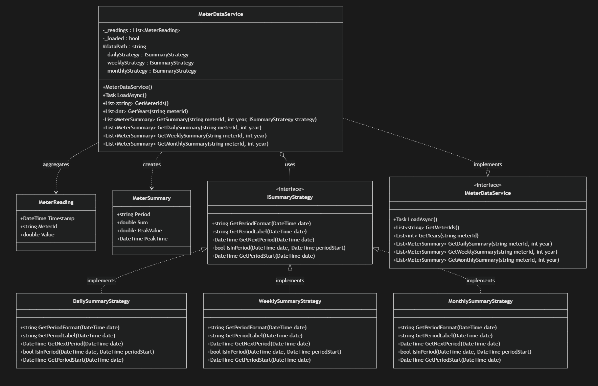

# Meter Dashboard Solution Overview

A web-based dashboard application built with Blazor to display and summarize meter reading data from a CSV file.

## Project Overview

The goal of this project is to develop a user-friendly dashboard that allows users to view meter reading data and analyze consumption patterns based on different time aggregations (daily, weekly, and monthly).

## Architecture and Design

The application follows a layered architecture:

-   **Data Layer:** Handles reading data from the `data.csv` file.
-   **Services Layer:** Contains the core business logic for loading, processing, and summarizing meter data. This layer utilizes the Strategy Pattern for flexible summary calculations.
-   **UI Components Layer:** Reusable Blazor components for displaying data.
-   **Pages Layer:** Blazor pages that compose UI components and interact with the Services Layer to fetch and display data.

### Class Diagram (Services Layer and related Models)

## Program Execution Flow

1.  **Application Startup:** The Blazor application starts. Dependency Injection is configured to provide an instance of `IMeterDataService` which resolved to `MeterDataService` to pages and components that require it.
2.  **Data Loading:** The `Home.razor` page calls the `LoadAsync()` method on the injected `IMeterDataService` instance. The `MeterDataService` reads the `data.csv` file, parses the meter readings, and stores them in memory. This loading typically happens **once** when the service is initialized or the application starts.
3.  **User Interaction:** The user interacts with the UI on the `Home.razor` page, selecting a Meter ID, Year, and Aggregation Type (Daily, Weekly, or Monthly).
4.  **Summary Request:** Based on the user's selections, the `Home.razor` page calls the appropriate summary method on the `IMeterDataService` (e.g., `GetDailySummary`, `GetWeeklySummary`, or `GetMonthlySummary`).
5.  **Summary Calculation (MeterDataService):** The `MeterDataService` receives the summary request. It delegates the period-specific logic to the relevant `ISummaryStrategy` instance (`_dailyStrategy`, `_weeklyStrategy`, or `_monthlyStrategy`).
    -   The `GetSummary` helper method in `MeterDataService` filters readings for the selected meter and year.
    -   It then iterates through these readings, using the chosen strategy's `GetPeriodStart` and `IsInPeriod` methods to group readings into distinct periods.
    -   For each period, it calculates the sum, peak value, and peak time.
    -   It uses the strategy's `GetPeriodLabel` to format the period name.
    -   A list of `MeterSummary` objects is created, one for each period with calculated totals.
6.  **Data Display (UI):** The `MeterDataService` returns the list of `MeterSummary` objects to the `Home.razor` page. The page then passes this data to a UI component (`SummaryTable.razor`) to display the aggregated summary information in a table format.
7.  **Paging:** With pagination implemented, the UI component will further process the list of `MeterSummary` objects to display only the data for the current page.
